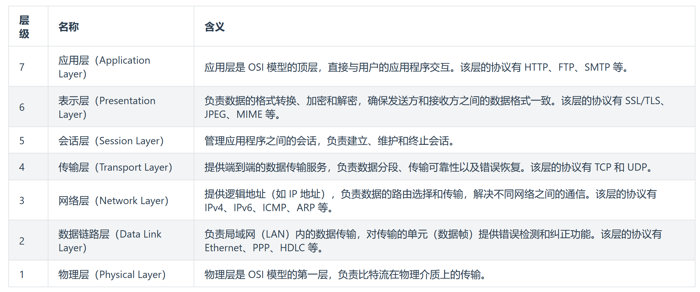
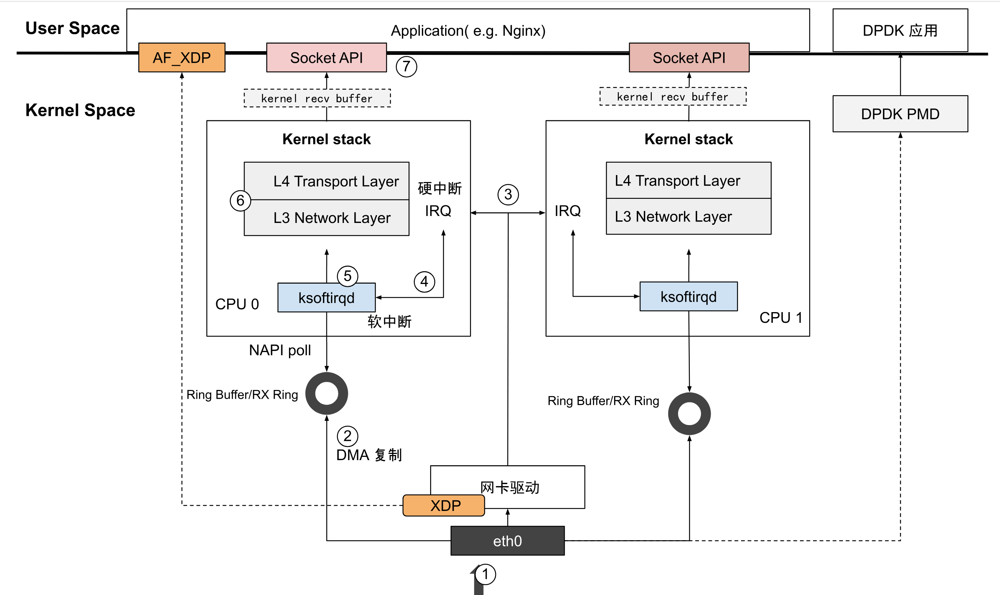
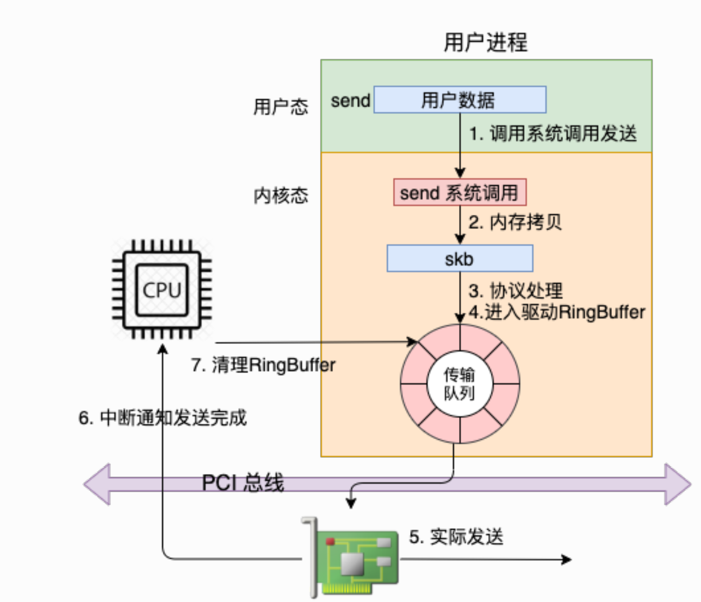
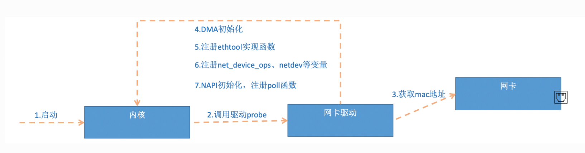
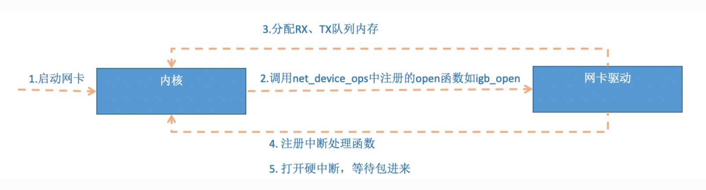

# IGC_Driver_Learning_Guide


# Intel I225 (IGC) 驱动学习指南

## 概述

Intel I225 (IGC) 驱动是Intel 2.5G以太网控制器的Linux内核驱动程序，支持I225、I226等系列网卡。该驱动支持高级特性如TSN (Time-Sensitive Networking)、PTP (Precision Time Protocol)、XDP (eXpress Data Path)等。
### 单芯片集成设计

```sh
┌─────────────────────────────────────────┐
│              I225 芯片                   │
│  ┌─────────────┐    ┌─────────────────┐  │
│  │             │    │                 │  │
│  │ MAC控制器    │◄──►│  集成PHY        │  │
│  │             │    │                 │  │
│  │ - DMA引擎   │    │ - 自动协商      │  │
│  │ - 帧处理    │    │ - 链路检测      │  │
│  │ - 中断控制  │    │ - 信号处理      │  │
│  │             │    │                 │  │
│  └─────────────┘    └─────────────────┘  │
│         │                      │         │
│         │                      │         │
│    ┌────▼────┐            ┌────▼────┐    │
│    │PCI接口  │            │RJ45接口 │    │
│    └─────────┘            └─────────┘    │
└─────────────────────────────────────────┘
```
### MAC控制方式

- 使用内存映射I/O (MMIO)
- 直接访问PCI设备的寄存器空间
- 速度快，适合高频操作

### PHY控制方式

- PHY可以是一个单独独立的芯片
- 使用MDIO串行总线协议
- 需要通过MAC的MDIO控制器间接访问
- 速度较慢，适合配置和状态查询
- 需要协议封装和锁机制

## MAC与PHY基本概念
### MAC
MAC (Media Access Control) 介质访问控制器
定义和功能：
MAC是OSI模型数据链路层的下半部分，负责：
帧处理
- 以太网帧的封装和解封装
- 添加/移除以太网头部（源MAC、目标MAC、类型等）
- 帧校验序列(FCS)的生成和验证
流控制
- 发送和接收缓冲区管理
- 流控制帧的处理（PAUSE帧）
- 背压控制
冲突检测和处理（半双工模式）
- CSMA/CD协议实现
- 冲突检测和退避算法
地址过滤
- 单播、多播、广播地址过滤
- VLAN标签处理
### PHY
PHY (Physical Layer) 物理层
定义和功能：PHY是OSI模型物理层的实现，负责：
信号转换
- 数字信号与模拟信号的转换
- 编码/解码（如曼彻斯特编码）
- 信号调制和解调
链路管理
- 自动协商（Auto-negotiation）
- 链路状态检测
- 速度和双工模式协商
物理介质接口
- 与网线、光纤等传输介质的接口
- 电气特性控制
- 信号完整性保证
错误检测
- 线路错误检测
- 信号质量监控
### MAC和PHY的关系
**1.层次关系**
应用层数据
    ↓
[MAC层] ← 驱动主要控制
    ↓ (MII/GMII/RGMII接口)
[PHY层] ← 驱动通过MDIO总线控制
    ↓
物理介质(网线/光纤)
**2. 接口关系**
MII/GMII/RGMII接口
MAC和PHY之间通过标准接口连接：
- MII (Media Independent Interface): 10/100Mbps
- GMII (Gigabit MII): 1000Mbps
- RGMII (Reduced GMII): 1000Mbps，引脚数减少
- SGMII (Serial GMII): 串行接口
**3.协作流程**
1.发送数据流程
```mermaid
sequenceDiagram
    participant Driver as 驱动
    participant MAC as MAC控制器
    participant PHY as PHY芯片
    participant Media as 物理介质
    
    Driver-&gt;&gt;MAC: 发送以太网帧
    MAC-&gt;&gt;MAC: 添加前导码、帧头
    MAC-&gt;&gt;MAC: 计算FCS校验
    MAC-&gt;&gt;PHY: 通过MII发送数字信号
    PHY-&gt;&gt;PHY: 数字信号编码
    PHY-&gt;&gt;Media: 发送模拟信号到网线
```
2. 接收数据流程
 ```mermaid
 sequenceDiagram
    participant Media as 物理介质
    participant PHY as PHY芯片  
    participant MAC as MAC控制器
    participant Driver as 驱动
    
    Media-&gt;&gt;PHY: 接收模拟信号
    PHY-&gt;&gt;PHY: 信号解码为数字信号
    PHY-&gt;&gt;MAC: 通过MII传输数字帧
    MAC-&gt;&gt;MAC: 校验FCS
    MAC-&gt;&gt;MAC: 地址过滤
    MAC-&gt;&gt;Driver: 产生中断，传递帧数据
```
### 驱动分层设计
igc_main.c (网络设备层)
    ↓
igc_mac.c (MAC抽象层)
    ↓  
igc_phy.c (PHY抽象层)
    ↓
igc_base.c (硬件访问层)

### 总结
MAC和PHY的关系
- 分工明确: MAC处理数据链路层，PHY处理物理层
- 紧密协作: 通过标准接口（MII系列）进行数据传输
- 统一管理: 驱动通过MDIO总线统一控制两者
- 层次化设计: 体现了网络协议栈的分层思想
在驱动开发中：
- MAC主要负责帧处理和DMA操作
- PHY主要负责链路管理和信号转换
- 驱动需要协调两者的初始化、配置和状态管理
- 错误处理需要区分MAC层和PHY层的不同错误类型

## Linux内核网络协议栈
### OSI网络分层模型


### Linux内核网络数据包流程


- 1 外部数据包到达主机时，首先由网卡 eth0 接收。
- 2 网卡通过 DMA将数据包拷贝到内核中的 RingBuffer（环形缓冲区）等待 CPU 处理。RingBuffer 是一种首尾相接的环形数据结构，它作为缓冲区，缓解网卡接收数据的速度快于 CPU 处理数据的速度问题。
- 3 网卡产生 IRQ（Interrupt Request，硬件中断），通知内核有新的数据包到达。
- 4 内核调用中断处理函数，标记新数据到达。接着，唤醒 ksoftirqd 内核线程，执行软中断（SoftIRQ）处理。
- 5 软中断处理中，内核调用网卡驱动的 NAPI（New API）poll 接口，从 RingBuffer 中提取数据包，并转换为 skb（Socket Buffer）格式。skb 是描述网络数据包的核心数据结构，无论是数据包的发送、接收还是转发，Linux 内核都会以 skb 的形式来处理。
- 6 skb 被传递到内核协议栈，在多个网络层次间处理：
  - 网络层（L3 Network layer）：根据主机中的路由表，判断数据包路由到哪一个网络接口（Network Interface）。这里的网络接口可能是虚拟设备，也可能是物理网卡 eth0 接口。
  - 传输层（L4 Transport layer）：处理网络地址转换（NAT）、连接跟踪（conntrack）等
- 7 内核协议栈处理完成后，数据包被传递到 socket 接收缓冲区。应用程序利用系统调用（如 Socket API）从缓冲区读取数据。至此，整个收包过程结束
&gt; 发包流程



### 网卡启动和初始化

&gt; 网卡初始化的通用流程


&gt; 网卡启动的通用流程




**关于网卡对接内核网络协议栈和协议栈注册的流程，可参考张彦飞写的《深入理解Linux网络》及其公众号文章，此处碍于篇幅不详细介绍**
## 驱动架构概览

### 核心组件

1. **硬件抽象层 (HAL)**
   - `igc_hw.h` - 硬件结构定义
   - `igc_base.c` - 基础硬件操作
   - `igc_i225.c` - I225特定实现
   - `igc_mac.c` - MAC层操作
   - `igc_phy.c` - PHY层操作
   - `igc_nvm.c` - NVM/EEPROM操作

2. **网络设备层**
   - `igc_main.c` - 主要驱动逻辑
   - `igc_ethtool.c` - Ethtool接口
   - `igc.h` - 主要数据结构定义

3. **高级特性**
   - `igc_ptp.c` - PTP时间同步
   - `igc_tsn.c` - TSN支持
   - `igc_xdp.c` - XDP支持

## 关键数据结构

### 1. igc_adapter
```c
struct igc_adapter {
    struct net_device *netdev;          // 网络设备
    struct pci_dev *pdev;               // PCI设备
    struct igc_hw hw;                   // 硬件抽象
    struct igc_ring *tx_ring[IGC_MAX_TX_QUEUES];  // 发送队列
    struct igc_ring *rx_ring[IGC_MAX_RX_QUEUES];  // 接收队列
    struct igc_q_vector *q_vector[MAX_Q_VECTORS]; // 中断向量
    // ... 其他字段
};
```

### 2. igc_hw
```c
struct igc_hw {
    void *back;                         // 指向adapter
    u8 __iomem *hw_addr;               // 硬件寄存器地址
    struct igc_mac_info mac;           // MAC信息
    struct igc_phy_info phy;           // PHY信息
    struct igc_nvm_info nvm;           // NVM信息
    // ... 其他字段
};
```

### 3. igc_ring
```c
struct igc_ring {
    struct igc_q_vector *q_vector;     // 关联的中断向量
    struct net_device *netdev;         // 网络设备
    void *desc;                        // 描述符环
    union {
        struct igc_tx_buffer *tx_buffer_info;  // TX缓冲区
        struct igc_rx_buffer *rx_buffer_info;  // RX缓冲区
    };
    // ... 其他字段
};
```

## 驱动初始化流程

### 1. 模块加载
```
igc_init_module()
├── pci_register_driver(&amp;igc_driver)
└── 注册PCI驱动
```

### 2. 设备探测
```
igc_probe()
├── pci_enable_device_mem()           // 启用PCI设备
├── dma_set_mask_and_coherent()       // 设置DMA掩码
├── pci_request_mem_regions()         // 请求内存区域
├── alloc_etherdev_mq()               // 分配网络设备
├── igc_sw_init()                     // 软件初始化
├── igc_reset()                       // 硬件重置
├── igc_get_hw_control()              // 获取硬件控制
├── register_netdev()                 // 注册网络设备
└── igc_ptp_init()                    // 初始化PTP
```

### 3. 软件初始化 (igc_sw_init)
```
igc_sw_init()
├── 设置默认环大小
├── 设置ITR值
├── 初始化工作队列
├── 分配MSI-X向量
└── 设置网络设备特性
```

## 网络设备操作

### 网络设备操作结构
```c
static const struct net_device_ops igc_netdev_ops = {
    .ndo_open           = igc_open,
    .ndo_stop           = igc_close,
    .ndo_start_xmit     = igc_xmit_frame,
    .ndo_set_rx_mode    = igc_set_rx_mode,
    .ndo_set_mac_address = igc_set_mac,
    .ndo_change_mtu     = igc_change_mtu,
    .ndo_tx_timeout     = igc_tx_timeout,
    .ndo_get_stats64    = igc_get_stats64,
    // ... 其他操作
};
```

### 设备启动流程
```
igc_open()
├── igc_setup_all_tx_resources()      // 设置TX资源
├── igc_setup_all_rx_resources()      // 设置RX资源
├── igc_request_irq()                 // 请求中断
├── igc_up()                          // 启动设备
│   ├── igc_configure()               // 配置硬件
│   ├── napi_enable()                 // 启用NAPI
│   ├── igc_configure_msix()          // 配置MSI-X
│   ├── igc_irq_enable()              // 启用中断
│   └── netif_tx_start_all_queues()   // 启动发送队列
└── 启动看门狗定时器
```

## 数据包处理流程

### 发送路径
```
igc_xmit_frame()
├── igc_tx_queue_mapping()            // 选择发送队列
└── igc_xmit_frame_ring()
    ├── 检查描述符可用性
    ├── 处理TSO/校验和卸载
    ├── 设置VLAN标签
    ├── 处理时间戳
    ├── 映射DMA缓冲区
    ├── 设置TX描述符
    └── 更新硬件尾指针
```

### 接收路径
```
中断处理
├── igc_intr_msi()                    // MSI中断处理
├── napi_schedule()                   // 调度NAPI
└── igc_poll()                        // NAPI轮询
    ├── igc_clean_tx_irq()            // 清理TX完成
    └── igc_clean_rx_irq()            // 处理RX数据包
        ├── 读取RX描述符
        ├── 分配新的RX缓冲区
        ├── 处理校验和
        ├── 处理VLAN标签
        ├── 构建skb
        └── netif_receive_skb()
```

## 中断处理机制

### 中断类型
1. **Legacy中断**: `igc_intr()`
2. **MSI中断**: `igc_intr_msi()`
3. **MSI-X中断**: 每个队列独立中断

### NAPI机制
```c
static int igc_poll(struct napi_struct *napi, int budget)
{
    // 清理TX完成
    if (q_vector-&gt;tx.ring)
        clean_complete = igc_clean_tx_irq(q_vector, budget);
    
    // 处理RX数据包
    if (rx_ring) {
        int cleaned = rx_ring-&gt;xsk_pool ?
                      igc_clean_rx_irq_zc(q_vector, budget) :
                      igc_clean_rx_irq(q_vector, budget);
        work_done &#43;= cleaned;
    }
    
    // 如果工作未完成，继续轮询
    if (!clean_complete)
        return budget;
    
    // 重新启用中断
    napi_complete_done(napi, work_done);
    igc_ring_irq_enable(q_vector);
    
    return work_done;
}
```

## 高级特性

### 1. TSN (Time-Sensitive Networking)
- 支持IEEE 802.1Qbv (时间感知调度)
- 支持IEEE 802.1Qbu (帧抢占)
- 支持IEEE 802.1Qav (信用基础整形)

### 2. PTP (Precision Time Protocol)
- 硬件时间戳支持
- IEEE 1588协议实现
- 高精度时间同步

### 3. XDP (eXpress Data Path)
- 内核旁路数据处理
- 高性能包处理
- eBPF程序支持

## 学习建议

### 入门阶段
1. **理解基础概念**
   - 熟悉Linux网络子系统
   - 了解PCI驱动模型
   - 学习DMA概念

2. **阅读顺序建议**
   ```
   igc.h → igc_hw.h → igc_main.c → igc_base.c
   ```

3. **关键函数理解**
   - `igc_probe()` - 设备初始化
   - `igc_open()` - 设备启动
   - `igc_xmit_frame()` - 数据包发送
   - `igc_poll()` - NAPI轮询

### 进阶阶段
1. **深入硬件抽象层**
   - 研究寄存器操作
   - 理解硬件特性
   - 学习固件交互

2. **高级特性学习**
   - TSN实现机制
   - PTP时间同步
   - XDP集成

3. **性能优化**
   - 中断合并
   - 缓存优化
   - 内存管理

### 调试技巧
1. **使用调试工具**
   ```bash
   # 查看网络统计
   ethtool -S eth0
   
   # 查看寄存器
   ethtool -d eth0
   
   # 查看驱动信息
   ethtool -i eth0
   ```

2. **内核调试**
   - 使用printk调试
   - 利用ftrace跟踪
   - 分析内核崩溃转储

## 相关资源

1. **Intel文档**
   - I225/I226数据手册
   - 软件开发者手册

2. **Linux内核文档**
   - Documentation/networking/
   - Documentation/driver-api/

3. **标准规范**
   - IEEE 802.1 TSN标准
   - IEEE 1588 PTP标准

## 实践练习

### 1. 基础练习
```bash
# 编译驱动
make -C /lib/modules/$(uname -r)/build M=$(pwd) modules

# 加载驱动
sudo insmod igc.ko

# 查看驱动信息
modinfo igc.ko
lsmod | grep igc

# 查看网络接口
ip link show
ethtool -i eth0
```

### 2. 调试练习
```bash
# 启用调试信息
echo &#39;module igc &#43;p&#39; &gt; /sys/kernel/debug/dynamic_debug/control

# 查看中断统计
cat /proc/interrupts | grep igc

# 查看网络统计
ethtool -S eth0

# 查看寄存器转储
ethtool -d eth0
```

### 3. 性能测试
```bash
# 使用iperf3测试性能
iperf3 -s  # 服务器端
iperf3 -c &lt;server_ip&gt; -t 60  # 客户端

# 使用netperf测试
netserver  # 服务器端
netperf -H &lt;server_ip&gt; -t TCP_STREAM  # 客户端
```

## 常见问题排查

### 1. 驱动加载失败
- 检查内核版本兼容性
- 确认PCI设备ID是否支持
- 查看dmesg输出错误信息

### 2. 网络性能问题
- 检查中断合并设置
- 调整环缓冲区大小
- 确认CPU亲和性设置

### 3. TSN功能异常
- 验证硬件是否支持TSN
- 检查时钟同步状态
- 确认调度配置正确

## 代码阅读路径

### 第一阶段：基础理解
1. `igc.h` - 了解主要数据结构
2. `igc_hw.h` - 理解硬件抽象
3. `igc_defines.h` - 熟悉常量定义
4. `igc_regs.h` - 了解寄存器布局

### 第二阶段：核心流程
1. `igc_main.c` 中的关键函数：
   - `igc_probe()` - 设备初始化
   - `igc_open()` - 接口启动
   - `igc_close()` - 接口关闭
   - `igc_xmit_frame()` - 数据包发送
   - `igc_poll()` - NAPI轮询

### 第三阶段：硬件操作
1. `igc_base.c` - 基础硬件操作
2. `igc_i225.c` - I225特定实现
3. `igc_mac.c` - MAC层操作
4. `igc_phy.c` - PHY层操作

### 第四阶段：高级特性
1. `igc_ptp.c` - PTP实现
2. `igc_tsn.c` - TSN实现
3. `igc_xdp.c` - XDP实现
4. `igc_ethtool.c` - Ethtool接口


## 总结

IGC驱动是一个功能丰富的现代网络驱动，集成了多种高级特性。学习该驱动有助于理解：
- Linux网络驱动开发模式
- 高性能网络处理技术
- 时间敏感网络应用
- 硬件卸载技术

建议从基础的PCI驱动和网络设备操作开始，逐步深入到高级特性的实现细节。通过实践练习和代码阅读，可以深入理解现代网络驱动的设计原理和实现技巧。


---

> Author: [Xueyu](https://github.com/xueyu-code)  
> URL: https://xueyu-code.github.io/posts/3f98aae/  

