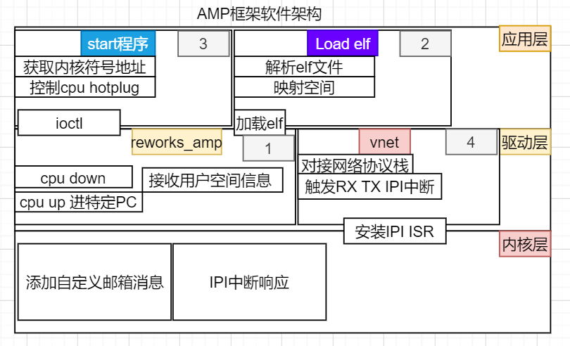
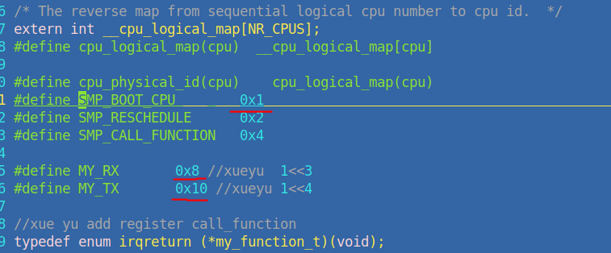
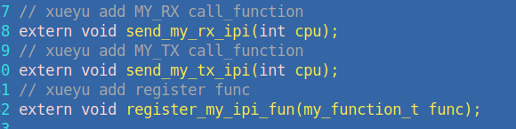
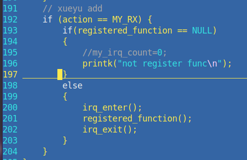
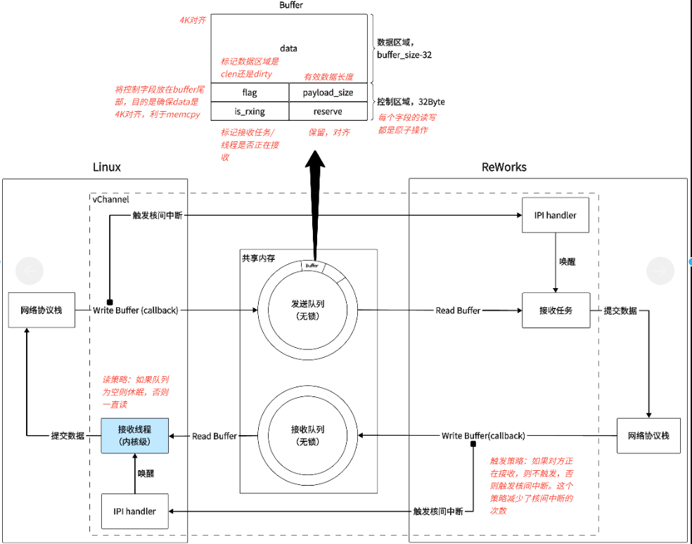

# Index


# 龙芯LoongArch异构多核处理器(AMP)框架详解
## 框架概述
这是一个基于龙芯LoongArch架构的**异构多核处理器(AMP - Asymmetric Multi-Processing)**框架，实现了Linux系统与裸机程序在双核系统中的协作处理。该框架允许CPU0运行完整的Linux系统，而CPU1运行高性能的rewors程序(理论上也可以是别的程序，比如vxworks的，只要BSP做好即可，毕竟CPU不会去区分到底是什么程序)，两者通过共享内存和核间中断进行通信(上层设计为虚拟网卡)。
### 系统架构图
```mermaid
graph TB
    subgraph &#34;CPU0 - Linux系统&#34;
        A[Linux内核]
        B[用户空间应用]
        C[reworks_amp.ko驱动]
        D[load_reworks加载器]
        E[test控制程序]
        F[虚拟网卡驱动]
    end
    
    subgraph &#34;CPU1 - Reworks系统&#34;
        G[reworks程序 reworks.elf]
        H[实时任务处理]
    end
    
    subgraph &#34;硬件层&#34;
        I[预留DDR内存 256MB]
        J[网络共享内存 2MB]
        K[核间中断IPI]
        L[Mailbox机制]
    end
    
    B --&gt; C
    C --&gt; I
    D --&gt; I
    E --&gt; C
    F --&gt; J
    G --&gt; I
    G --&gt; J
    C --&gt; K
    C --&gt; L
    K --&gt; G
    L --&gt; G
```


### 系统启动流程
```mermaid
sequenceDiagram
    participant Script as start.sh
    participant Driver as reworks_amp.ko
    participant Loader as load_reworks
    participant Test as test程序
    participant CPU1 as CPU1核心
    
    Script-&gt;&gt;Driver: insmod reworks_amp.ko
    Driver-&gt;&gt;Driver: 创建/dev/reworks_amp设备
    Script-&gt;&gt;Loader: ./load_reworks reworks.elf
    Loader-&gt;&gt;Driver: mmap共享内存
    Loader-&gt;&gt;Loader: 加载ELF到共享内存
    Script-&gt;&gt;Test: ./test
    Test-&gt;&gt;Driver: ioctl停止CPU1
    Test-&gt;&gt;Driver: ioctl启动CPU1
    Driver-&gt;&gt;CPU1: 发送程序入口&#43;IPI中断
    CPU1-&gt;&gt;CPU1: 开始执行裸机程序
    Script-&gt;&gt;Script: top (监控系统状态)
```
### 核心特性
- 异构处理：CPU0运行Linux，CPU1运行裸机程序
- 零拷贝通信：基于共享内存的高效数据传输
- 实时性保证：高实时RTOS程序提供确定性实时响应
- 标准接口：提供标准的网络设备接口
- 可扩展性：支持多种RTOS和Linux应用的集成
- reworks终端对应的串口中断以及2个CPU的2个IPI中断已经在BSP中做好中断路由
- 动态控制：支持运行时启停CPU核心，该框架运行之后如果用户想让CPU1回到Linux调度,
可以让用户在reworks的终端中退出系统，此时即可让出CPU。然后再通过Linux下的CPU热插拔机制
重新加载CPU1，此时即可回到Linux调度。
## 框架组件梳理
### 目录结构(暂定)
```sh
Linux_code/
├── ko/                     # 内核驱动模块
│   ├── reworks_amp.c      # AMP控制驱动
│   └── make.sh            # 编译脚本
├── load/                   # ELF加载器
│   └── load_reworks.c     # elf程序加载器
├── start/                  # 测试
│   ├── test.c             # 测试程序
│   └── build.sh           # 编译脚本
├── my_shm/                # 通信机制
│   ├── supper_shm_net.c   # 虚拟网卡驱动
│   ├── Makefile           # 编译配置
│   └── make.sh            # 编译脚本
├── ls2k_pai.dts           # 设备树配置
├── start.sh               # 系统启动脚本
├── bridge.sh              # 网桥配置脚本
└── net0_init.sh           # 网络初始化脚本
```
### AMP控制驱动
AMP控制驱动是整个框架的核心，它负责管理CPU1的启动和停止以及共享内存映射
&gt; 核心数据结构
```c
struct export_func {
    unsigned long cpu_logical_map_func;           // CPU逻辑映射函数
    unsigned long loongson3_send_ipi_single_func; // 核间中断发送函数(这个最重要)
    unsigned long local_flush_icache_range_func;  // 指令缓存刷新函数
    unsigned long loongarch_cpu_irq_init_func;    // CPU中断初始化函数
    unsigned long loongson3_prepare_cpus_func;    // CPU准备函数
};
```
&gt; 关键函数(向mailbox发送命令)
```c
static void xy_csr_mail_send(uint64_t data, int cpu, int mailbox)
{
    uint64_t val;
    // 发送高32位
    val = IOCSR_MBUF_SEND_BLOCKING;
    val |= (IOCSR_MBUF_SEND_BOX_HI(mailbox) &lt;&lt; IOCSR_MBUF_SEND_BOX_SHIFT);
    val |= (cpu &lt;&lt; IOCSR_MBUF_SEND_CPU_SHIFT);
    val |= (data &amp; IOCSR_MBUF_SEND_H32_MASK);
    iocsr_write64(val, LOONGARCH_IOCSR_MBUF_SEND);
    // 发送低32位
    val = IOCSR_MBUF_SEND_BLOCKING;
    val |= (IOCSR_MBUF_SEND_BOX_LO(mailbox) &lt;&lt; IOCSR_MBUF_SEND_BOX_SHIFT);
    val |= (cpu &lt;&lt; IOCSR_MBUF_SEND_CPU_SHIFT);
    val |= (data &lt;&lt; IOCSR_MBUF_SEND_BUF_SHIFT);
    iocsr_write64(val, LOONGARCH_IOCSR_MBUF_SEND);
}
```
&gt; 关键函数(管理CPU1，对接ioctl)
```c
static long cpu_handle(unsigned int cmd, unsigned long arg)
{
    switch(cmd) {
        case STOP:  
            cpu_down(1);                    // 停止CPU1
            printk(KERN_INFO &#34;stop cpu1&#34;);
            break;
        case START:
            printk(KERN_INFO &#34;start cpu1&#34;);
            xy_csr_mail_send(entry, 1, 0); // 发送程序入口地址
            send_ipi_single_func(1, 1);     // 发送核间中断唤醒CPU1
            break;
    }
}
```

&gt; 地址配置


或者是在Makefile中通过-Wtext 手动指定代码段入口位置也可以
```c
#define PHYS_ADDR    (0x00000000c0000070UL) #此处的70是自动偏移的，可使用readelf-a reworks.elf查看入口地址
```

**注意，此处send_ipi_single_func发送0x1,是mailbox的特定功能码，具体可参照龙芯内核代码**
**下面是针对龙芯内核(Linux4.19)代码的改动**
&gt; /arch/loongarch/include/asm/smp.h



- MY_RX MY_TX是后面虚拟网卡通信用到的两个mailbox功能码‘
- 0x01代表启动CPU的功能码
- register_my_ipi_fun用于注册用户自定义的回调函数

&gt; ./arch/loongarch/la64/smp.c


- 触发IPI中断后根据mailbox中的功能码进行功能匹配，手动添加咱们功能码对应的操作
- registered_function是驱动注册进内核的函数，这样做到虚拟网卡驱动和内核的勾连回调
### ELF加载器
&gt; 大致流程
```mermaid
flowchart TD
    A[打开/dev/reworks_amp设备] --&gt; B[mmap映射共享内存]
    B --&gt; C[使用BFD库打开ELF文件]
    C --&gt; D[第一次遍历：计算内存需求]
    D --&gt; E[检查内存是否足够]
    E --&gt; F[第二次遍历：加载程序段]
    F --&gt; G[处理代码段SEC_LOAD]
    G --&gt; H[处理数据段和BSS段]
    H --&gt; I[刷新CPU缓存]
    I --&gt; J[完成加载]
```
#### 关键代码分析
&gt; 内存映射初始化
```c
int init_base()
{
    pa_base = 0xb0000000UL;
    
    mmap_fd = open(&#34;/dev/reworks_amp&#34;, O_RDWR);
    if (mmap_fd &lt; 0) {
        fprintf(stderr, &#34;[ERROR]: open device failed: %s\n&#34;, strerror(errno));
        return -1;
    }

    va = mmap(NULL, MEMORY_SIZE, PROT_READ | PROT_WRITE, MAP_SHARED, mmap_fd, 0);  
    if (va == MAP_FAILED) {  
        fprintf(stderr, &#34;[ERROR]: mmap failed: %s\n&#34;, strerror(errno));
        return -2;  
    }
    
    va_base = (unsigned long)va;
    preallocated_memory = va;
    preallocated_size = MEMORY_SIZE;
}
```
&gt; ELF加载逻辑
```c
void load_elf_to_preallocated_memory(const char *filename) 
{
    // 第一次遍历：计算地址范围
    for (section = abfd-&gt;sections; section != NULL; section = section-&gt;next) {
        bfd_vma vma = bfd_section_vma(section);
        size = bfd_section_size(section);
        
        if (vma &lt; lowest_vma) lowest_vma = vma;
        if (vma &#43; size &gt; highest_vma) highest_vma = vma &#43; size;
    }
    // 第二次遍历：加载段内容
    for (section = abfd-&gt;sections; section != NULL; section = section-&gt;next) {
        bfd_vma offset = vma - lowest_vma;
        
        if ((bfd_section_flags(section) &amp; SEC_LOAD) != 0) {
            // 加载可执行段
            bfd_get_section_contents(abfd, section, preallocated_memory &#43; offset, 0, size);
        } else if (!(bfd_section_flags(section) &amp; SEC_HAS_CONTENTS)) {
            // 清零BSS段
            memset(preallocated_memory &#43; offset, 0, size);
        }
        // 刷新CPU缓存
        __builtin___clear_cache((void*)(preallocated_memory &#43; offset), 
                               (void*)(preallocated_memory &#43; offset &#43; size));
    }
}
```
### 测试程序
测试程序用于验证AMP框架的基本功能，包括启动和停止CPU1，以及加载ELF程序
&gt; 大致流程
```mermaid
sequenceDiagram
    participant User as 用户程序
    participant Test as test程序
    participant Driver as reworks_amp驱动
    participant CPU1 as CPU1核心
    
    User-&gt;&gt;Test: 启动控制程序
    Test-&gt;&gt;Test: 解析/proc/kallsyms获取内核函数地址
    Test-&gt;&gt;Driver: ioctl(IOCTL_STOP) 停止CPU1
    Driver-&gt;&gt;CPU1: cpu_down(1)
    Test-&gt;&gt;Driver: ioctl(IOCTL_START) 启动CPU1
    Driver-&gt;&gt;CPU1: 发送邮箱消息(程序入口)
    Driver-&gt;&gt;CPU1: 发送核间中断IPI
    CPU1-&gt;&gt;CPU1: 开始执行reworks程序
```
#### 关键代码分析
&gt; 内核符号地址获取
- 相当于获取一些内核函数，无需用户在应用层包含内核各种不透明的头文件
```c
unsigned long get_symbol_address(const char *symbol_name)
{
    FILE *fp = fopen(&#34;/proc/kallsyms&#34;, &#34;r&#34;);
    
    while (fgets(line, sizeof(line), fp)) {
        token = strtok(line, &#34; &#34;);           // 地址
        address = strtoul(token, NULL, 16);  // 转换为数值
        
        token = strtok(NULL, &#34; &#34;);           // 符号类型
        token = strtok(NULL, &#34; \n&#34;);         // 符号名称
        
        if (strcmp(token, symbol_name) == 0) {
            return address;
        }
    }
    return 0;
}
```
### 虚拟网卡驱动
虚拟网卡驱动用于实现共享内存上的数据传输，为AMP框架提供网络通信能力
&gt; 大致框架

&gt; 初始化流程
```mermaid
flowchart TD
    A[平台设备探测] --&gt; B[解析设备树获取内存区域]
    B --&gt; C[ioremap映射共享内存]
    C --&gt; D[初始化共享内存管理]
    D --&gt; E[创建共享内存实例]
    E --&gt; F[设置TX/RX环形缓冲区]
    F --&gt; G[注册中断处理函数]
    G --&gt; H[创建网络设备]
    H --&gt; I[启动接收线程]
    I --&gt; J[注册网络设备]
```
#### 数据传输机制详解
**注：reworks那边的代码和流程也是类似的，毕竟都是POSIX接口，详情请参考提交到仓库中的龙芯AMP_BSP包**

**发送数据流程**：

```mermaid
sequenceDiagram
    participant App as 应用程序
    participant NetStack as Linux网络栈
    participant Driver as 共享内存驱动
    participant TxRing as TX环形缓冲区
    participant CPU1 as CPU1程序

    App-&gt;&gt;NetStack: send(socket, data)
    NetStack-&gt;&gt;Driver: my_start_xmit(skb)
    Driver-&gt;&gt;Driver: 检查TX缓冲区是否有空闲
    alt 缓冲区满
        Driver-&gt;&gt;Driver: 重试等待
    else 缓冲区可用
        Driver-&gt;&gt;TxRing: write_tx_ring(data)
        Driver-&gt;&gt;TxRing: 设置flag=DIRTY
        Driver-&gt;&gt;CPU1: send_my_rx_ipi(1) 发送中断
        CPU1-&gt;&gt;CPU1: 中断唤醒处理数据
    end
```

**发送函数实现**：
```c
static netdev_tx_t my_start_xmit(struct sk_buff *skb, struct net_device *dev)
{
    struct my_netdev_priv *priv = netdev_priv(dev);

retry:
    // 写入TX环形缓冲区
    if (write_tx_ring(priv-&gt;shm_id, skb-&gt;data, skb-&gt;len) != 0) {
        printk(&#34;my_start_xmit write tx failed!.....\n&#34;);
        goto retry;  // 缓冲区满时重试
    }

    // 更新统计信息
    priv-&gt;stats.tx_packets&#43;&#43;;
    priv-&gt;stats.tx_bytes &#43;= skb-&gt;len;
    dev_kfree_skb(skb);

    // 通知对方CPU有新数据
    if (!is_rxing(priv-&gt;shm_id)) {
        send_my_rx_ipi(1); // 发送核间中断
    }

    return NETDEV_TX_OK;
}
```

**写入环形缓冲区函数**：
```c
int write_tx_ring(s_shm_id_t id, void* data, shm_u32_t size)
{
    s_shm_t* shm = s_shms &#43; id;
    s_buffer_t* buffer = NULL;
    s_ring_t* ring = (shm-&gt;role == ROLE_HOST) ? &amp;(shm-&gt;tx_ring) : &amp;(shm-&gt;rx_ring);

    buffer = ring-&gt;current_pos;

    // 原子检查缓冲区状态
    if (__atomic_load_n(&amp;buffer-&gt;flag, __ATOMIC_SEQ_CST) != FLAG_CLEAN) {
        return -1;  // 缓冲区忙，返回失败
    }

    // 复制数据到缓冲区
    memcpy(buffer-&gt;data, data, size);
    buffer-&gt;payload_size = size;

    // 原子设置缓冲区为脏状态
    __atomic_store_n(&amp;buffer-&gt;flag, FLAG_DIRTY, __ATOMIC_SEQ_CST);

    // 移动到下一个缓冲区
    if ((s_shm_addr_t)(buffer &#43; 1) &gt; ring-&gt;end) {
        ring-&gt;current_pos = (s_buffer_t*)(ring-&gt;start);  // 环形回绕
    } else {
        ring-&gt;current_pos = buffer &#43; 1;
    }

    return 0;
}
```

**接收数据流程**：

```mermaid
sequenceDiagram
    participant CPU1 as CPU1程序
    participant RxRing as RX环形缓冲区
    participant Driver as 共享内存驱动
    participant Thread as 接收线程
    participant NetStack as Linux网络栈

    CPU1-&gt;&gt;RxRing: 写入数据包
    CPU1-&gt;&gt;Driver: 发送中断通知
    Driver-&gt;&gt;Thread: complete(&amp;my_completion) 唤醒线程
    Thread-&gt;&gt;RxRing: read_rx_ring() 读取数据
    Thread-&gt;&gt;Thread: 分配sk_buff
    Thread-&gt;&gt;NetStack: netif_rx_ni(skb) 提交到网络栈
    NetStack-&gt;&gt;NetStack: 协议栈处理
```

**接收线程实现**：
```c
static void my_rx(void* dev)
{
    struct my_netdev_priv *priv = netdev_priv((struct net_device*)dev);
    unsigned int size;

    do {
        struct sk_buff *skb;
retry:
        // 从RX环形缓冲区读取数据
        if (read_rx_ring(priv-&gt;shm_id, (void**)&amp;skb, &amp;size) != 0) {
            up_rxing(priv-&gt;shm_id, 0);           // 标记非接收状态
            wait_for_completion(&amp;my_completion);  // 等待中断唤醒
            up_rxing(priv-&gt;shm_id, 1);           // 标记接收状态
            reinit_completion(&amp;my_completion);
            goto retry;
        }

        // 设置网络包属性
        skb-&gt;dev = dev;
        skb-&gt;protocol = eth_type_trans(skb, dev);
        skb-&gt;ip_summed = CHECKSUM_UNNECESSARY;

        // 更新统计信息
        priv-&gt;stats.rx_packets&#43;&#43;;
        priv-&gt;stats.rx_bytes &#43;= size;

        // 提交到网络栈
        netif_rx_ni(skb);
    } while(1);
}
```

**读取环形缓冲区函数**：
```c
int read_rx_ring(s_shm_id_t id, void** data, shm_u32_t* size)
{
    s_shm_t* shm = s_shms &#43; id;
    s_buffer_t* buffer = NULL;
    s_ring_t* ring = (shm-&gt;role == ROLE_HOST) ? &amp;(shm-&gt;rx_ring) : &amp;(shm-&gt;tx_ring);
    struct sk_buff** skb = (struct sk_buff**)data;

    buffer = ring-&gt;current_pos;

    // 原子检查是否有数据
    if (__atomic_load_n(&amp;buffer-&gt;flag, __ATOMIC_SEQ_CST) != FLAG_DIRTY) {
        return -1;  // 没有数据
    }

    *size = buffer-&gt;payload_size;

    // 分配sk_buff
    *skb = dev_alloc_skb(*size);
    if (!(*skb)) {
        printk(&#34;dev_alloc_skb failed!, size = %d\n&#34;, *size);
        return -2;
    }

    // 复制数据到sk_buff
    memcpy(skb_put(*skb, *size), (char*)(buffer-&gt;data), *size);

    // 原子清除缓冲区状态
    __atomic_store_n(&amp;buffer-&gt;flag, FLAG_CLEAN, __ATOMIC_SEQ_CST);

    // 移动到下一个缓冲区
    if ((s_shm_addr_t)(buffer &#43; 1) &gt; ring-&gt;end) {
        ring-&gt;current_pos = (s_buffer_t*)(ring-&gt;start);
    } else {
        ring-&gt;current_pos = buffer &#43; 1;
    }

    return 0;
}
```
#### 中断处理机制

**中断处理函数**：
```c
// 中断处理函数
static irqreturn_t my_rx_interrupt(void)
{
    // 唤醒接收线程
    complete(&amp;my_completion);
    return IRQ_HANDLED;
}
```

**中断注册和线程创建**：
```c
static int my_probe(struct platform_device *pdev)
{
    // ... 其他初始化代码 ...

    // 注册中断处理函数
    register_my_ipi_fun(&amp;my_rx_interrupt);

    // 创建接收线程
    thread_st = kthread_run(thread_fn, dev, &#34;my_net_thread&#34;);
    if (thread_st) {
        printk(KERN_INFO &#34;Thread created successfully\n&#34;);
    } else {
        printk(KERN_ERR &#34;Thread creation failed\n&#34;);
    }

    return 0;
}
```

#### 关键代码设计
&gt; 共享内存管理结构

```c
// 基础类型定义
typedef void* s_shm_addr_t;
typedef unsigned int s_shm_size_t;
typedef int s_shm_id_t;
typedef unsigned int shm_u32_t;
typedef unsigned char shm_u8_t;
typedef int shm_role_t;

#define ROLE_HOST     (0)    // CPU0作为主机
#define ROLE_REMOTE   (1)    // CPU1作为远程端
#define INVALID_ID    (-1)
#define FLAG_CLEAN    (0)    // 缓冲区空闲
#define FLAG_DIRTY    (1)    // 缓冲区有数据
```
&gt; 环形缓冲区设计
```c
// 缓冲区结构（64字节对齐优化缓存性能）
typedef struct __attribute__((aligned(64))) s_buffer {
    shm_u8_t data[BUFFER_DATA_MAX_SIZE];  // 数据载荷
    shm_u32_t flag;                       // 状态标志：CLEAN/DIRTY
    shm_u32_t payload_size;               // 有效数据大小
    shm_u32_t is_rxing;                   // 接收状态标志
    shm_u32_t reserve;                    // 保留字段
} s_buffer_t;
// 环形队列管理结构
typedef struct __attribute__((aligned(64))) s_ring {
    s_shm_addr_t start;        // 起始地址
    s_shm_addr_t end;          // 结束地址
    s_buffer_t* current_pos;   // 当前位置指针
} s_ring_t;
// 共享内存描述符
typedef struct __attribute__((aligned(64))) s_shm {
    shm_role_t role;           // 角色：HOST/REMOTE
    s_shm_addr_t va;           // 虚拟地址
    s_shm_addr_t pa;           // 物理地址
    s_shm_size_t size;         // 内存大小
    s_shm_id_t id;             // 共享内存ID
    s_ring_t tx_ring;          // 发送环形缓冲区
    s_ring_t rx_ring;          // 接收环形缓冲区
} s_shm_t;
```


&gt; 数据发送
```c
static netdev_tx_t my_start_xmit(struct sk_buff *skb, struct net_device *dev)
{
    struct my_netdev_priv *priv = netdev_priv(dev);
retry:
    // 写入TX环形缓冲区
    if (write_tx_ring(priv-&gt;shm_id, skb-&gt;data, skb-&gt;len) != 0) {
        printk(&#34;my_start_xmit write tx failed!.....\n&#34;);
        goto retry;  // 缓冲区满时重试
    }
    // 更新统计信息
    priv-&gt;stats.tx_packets&#43;&#43;;
    priv-&gt;stats.tx_bytes &#43;= skb-&gt;len;
    dev_kfree_skb(skb);

    // 通知对方CPU有新数据
    if (!is_rxing(priv-&gt;shm_id)) {
        send_my_rx_ipi(1); // 发送核间中断
    }

    return NETDEV_TX_OK;
}
```
&gt; 数据接收
```c
static void my_rx(void* dev)
{
    struct my_netdev_priv *priv = netdev_priv((struct net_device*)dev);
    
    do {
        struct sk_buff *skb;
retry:
        // 从RX环形缓冲区读取数据
        if (read_rx_ring(priv-&gt;shm_id, (void**)&amp;skb, &amp;size) != 0) {
            up_rxing(priv-&gt;shm_id, 0);           // 标记非接收状态
            wait_for_completion(&amp;my_completion);  // 等待中断唤醒
            up_rxing(priv-&gt;shm_id, 1);           // 标记接收状态
            reinit_completion(&amp;my_completion);
            goto retry;
        }
        // 设置网络包属性
        skb-&gt;dev = dev;
        skb-&gt;protocol = eth_type_trans(skb, dev);
        skb-&gt;ip_summed = CHECKSUM_UNNECESSARY;
        // 更新统计信息
        priv-&gt;stats.rx_packets&#43;&#43;;
        priv-&gt;stats.rx_bytes &#43;= size;
        // 提交到内核网络协议栈
        netif_rx_ni(skb);
    } while(1);
}
```

&gt; 性能优化特性
- 共享内存：避免数据在内核空间和用户空间之间拷贝
- ring buf设计：无锁环形缓冲区设计
- 原子操作：使用__atomic_load_n和__atomic_store_n保证多核并发安全


## 设备树配置
&gt; 内存布局配置
```c
reserved-memory {
    #address-cells = &lt;2&gt;;
    #size-cells = &lt;2&gt;;
    ranges;
    // 裸机程序运行内存：256MB
    rproc: rproc@c0000000 {
        no-map;
        reg = &lt;0x0 0xc0000000 0x0 0x10000000&gt;;
    };
    // 网络共享内存：2MB
    net_shm:shm_net@ec000000{
        no-map;
        reg=&lt;0x0 0xea000000 0x0 0x200000&gt;;
    };
};
```
&gt; 虚拟网卡节点配置
```c
homo_rproc: homo_rproc@0 {
    compatible = &#34;homo,rproc&#34;;
    remote-processor = &lt;1&gt;;              // 目标CPU1
    inter-processor-interrupt = &lt;9&gt;;     // 核间中断号
    memory-region = &lt;&amp;rproc&gt;;           // 关联内存区域
    firmware-name = &#34;reworks.elf&#34;;      // 裸机程序文件名
};

shm_net:shm_net@0{
    compatible = &#34;shm_net&#34;;
    remote-processor = &lt;1&gt;;
    interrupt-parent = &lt;&amp;cpuic&gt;;
    inter-processor-interrupt = &lt;12&gt;;    // 网络中断号
    memory-region = &lt;&amp;net_shm&gt;;         // 网络共享内存
};
```
**注：本来打算利用Linux下的remoteproc框架，但是发现remoteproc框架并不能马上适配到龙芯上，因为这部分参考飞腾平台设计发现会利用ARM指令集的一些机制触发异常来做安全等级切换，与ARM架构强相关，所以不能完全参考**

## 存在问题
- 由于时间仓促同时也为了便于用户使用，不得不走了一遍内核网络协议栈，这部分是性能瓶颈
- 由于2K1000的phy1,phy2都是挂在龙芯内部同一个PCIE控制器上，所以无法做到把2个phy在OS层
的隔离控制，不得不使用网桥，这部分也是性能瓶颈
- 高速触发IPI中断时，有时候会丢中断，联系龙芯官方得知无法优化，当时芯片设计的时候没有考虑到AMP的需求，所以这部分无法优化，他们官方测也是会偶发性丢中断
- iperf3测试时某些情况时会出现系统崩溃的情况，详情参考专门的测试文档

---

> Author:   
> URL: https://xueyu-code.github.io/posts/4fecd7a/  

