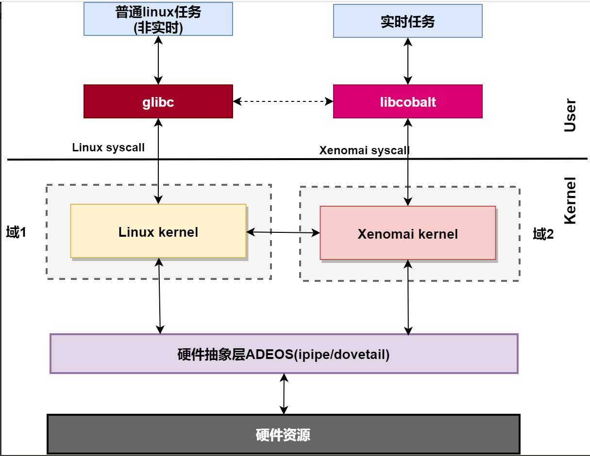
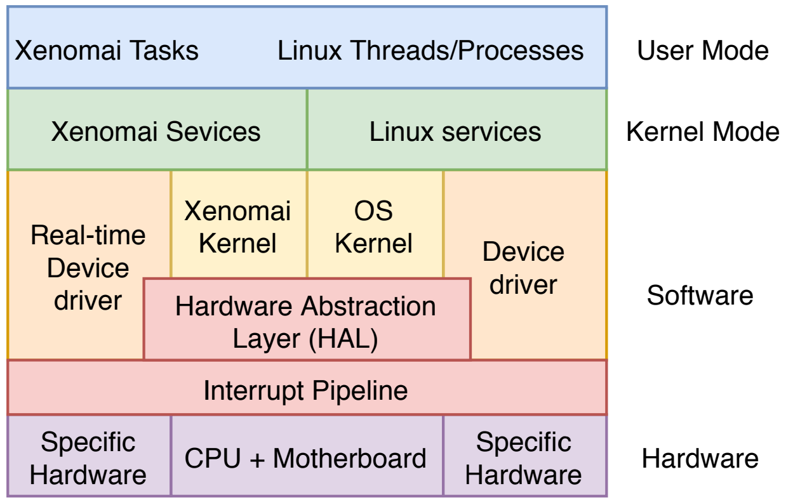
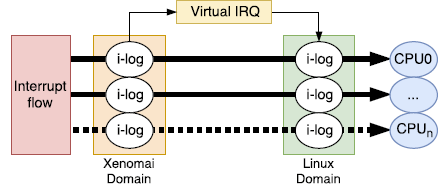
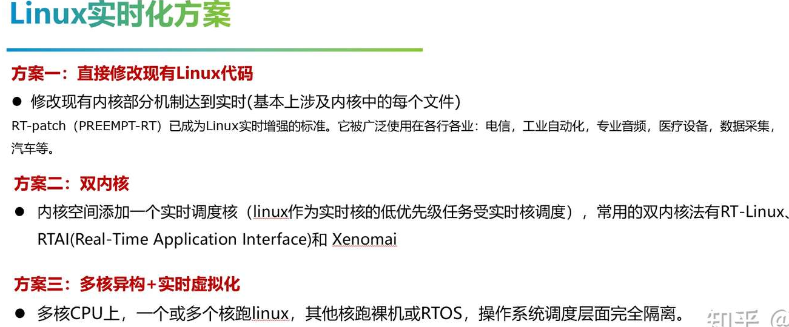
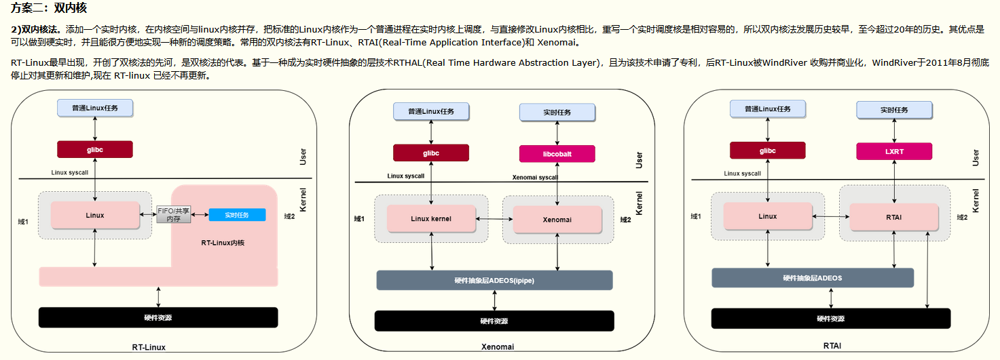
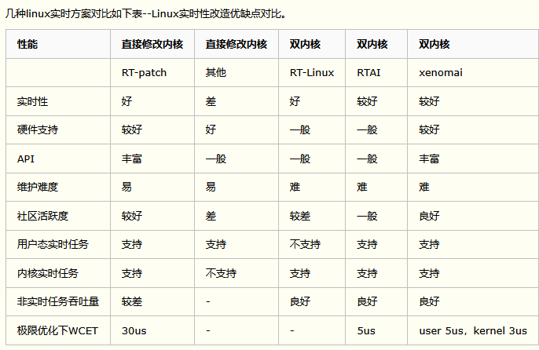

# Linux实时化初探


# 整体框架
xenomai3的整体结构如下



---
**在内核空间，在标准linux基础上添加一个实时内核Cobalt，得益于基于ADEOS（Adaptive Domain Environment for Operating System)，使Cobalt在内核空间与linux内核并存，并把标准的Linux内核作为实时内核中的一个idle进程在实时内核上调度**

ADEOS ,其核心思想是Domain,也就是范围的意思，linux内核有linux内核的范围，cobalt内核有cobalt内核的范围。
- 两个内核管理各自范围内的应用、驱动、中断
- 两个domain之间有优先级之分，cobalt内核优先级高于linux内核
- I-pipe优先处理高优先级域的中断，来保证高优先级域的实时性
- 高优先级域可以通过I-pipe 向低优先级域发送各类事件等
**在用户空间**，添加针对实时应用优化的库--libcobalt，libcobalt提供POSIX接口给应用空间实时任务使用，应用通过libcobalt让实时内核cobalt提供服务。
**驱动方面**，xenomai提供实时驱动框架模型RTDM（Real-Time Driver Model）,专门用于Cobalt内核，基于RTDM进行实时设备驱动开发，为实时应用提供实时驱动。RTDM将驱动分为2类：
- 字符设备 如串口等
- 协议设备 如UDP/TCP CAN
**中断方面**，I-Pipe(interrupt Pipeline)分发Linux和Xenomai之间的中断，并以Domain优先级顺序传递中断。I-Pipe传递中断如下图所示，对于实时内核注册的中断，中断产生后能够直接得到处理，保证实时性。对于linux的中断，先将中断记录在i-log，等实时任务让出CPU后，linux得到运行，该中断才得到处理。


&gt; 更多信息可参考如下链接 https://www.cnblogs.com/wsg1100/p/12833126.html

# 其他Linux实时化方案



PREEMPT-RT方案主要缺点：通过修改Linux内核，难以保证实时进程的执行不会遭到非实时进程所进行的不可预测活动的干扰





**Linux实时化如此艰难的主要原因是Linux中有非常明显的内核态和用户态的区分（本身从用户态陷入内核态就是个实时性很差的机制），内核态中各种临界区是不能抢占的，哪怕打完RT补丁，还是有很多地方不能抢占，比如spinlock默认禁止抢占（整个内核态有10万&#43;地方使用），同时硬中断的执行时间不确定，软中断总是抢占应用上下文等等影响任务调度时间的地方。**


---

> Author: [薛羽](https://github.com/xueyu-code)  
> URL: https://xueyu-code.github.io/posts/68f9b38/  

--&gt; T3[igc_free_all_tx_resources]
    T --&gt; T4[igc_free_all_rx_resources]
    
    style A fill:#e1f5fe
    style C fill:#f3e5f5
    style J fill:#e8f5e8
    style Q fill:#fff3e0
    style R fill:#fce4ec
    style S fill:#f1f8e9
```

## 2. IGC驱动硬件抽象层架构图

```mermaid
graph TB
    subgraph &#34;应用层&#34;
        APP[应用程序]
        SOCK[Socket接口]
    end
    
    subgraph &#34;Linux内核网络栈&#34;
        NET[网络协议栈]
        NETDEV[网络设备层]
        NAPI[NAPI机制]
    end
    
    subgraph &#34;IGC驱动层&#34;
        MAIN[igc_main.c&lt;br/&gt;主驱动逻辑]
        ETHTOOL[igc_ethtool.c&lt;br/&gt;Ethtool接口]
        
        subgraph &#34;高级特性模块&#34;
            PTP[igc_ptp.c&lt;br/&gt;PTP时间同步]
            TSN[igc_tsn.c&lt;br/&gt;TSN支持]
            XDP[igc_xdp.c&lt;br/&gt;XDP支持]
            DIAG[igc_diag.c&lt;br/&gt;硬件诊断]
        end
        
        subgraph &#34;硬件抽象层&#34;
            BASE[igc_base.c&lt;br/&gt;基础HAL]
            I225[igc_i225.c&lt;br/&gt;I225特定实现]
            MAC[igc_mac.c&lt;br/&gt;MAC层操作]
            PHY[igc_phy.c&lt;br/&gt;PHY层操作]
            NVM[igc_nvm.c&lt;br/&gt;NVM操作]
        end
        
        subgraph &#34;数据结构定义&#34;
            IGC_H[igc.h&lt;br/&gt;主要结构]
            HW_H[igc_hw.h&lt;br/&gt;硬件结构]
            REGS[igc_regs.h&lt;br/&gt;寄存器定义]
            DEFINES[igc_defines.h&lt;br/&gt;常量定义]
        end
    end
    
    subgraph &#34;硬件层&#34;
        subgraph &#34;I225/I226控制器&#34;
            MAC_HW[MAC控制器]
            PHY_HW[PHY控制器]
            DMA_HW[DMA引擎]
            PTP_HW[PTP硬件]
            TSN_HW[TSN硬件]
        end
        
        PCI[PCI总线]
        MEM[内存映射I/O]
    end
    
    %% 连接关系
    APP --&gt; SOCK
    SOCK --&gt; NET
    NET --&gt; NETDEV
    NETDEV --&gt; MAIN
    
    MAIN --&gt; ETHTOOL
    MAIN --&gt; PTP
    MAIN --&gt; TSN
    MAIN --&gt; XDP
    ETHTOOL --&gt; DIAG
    
    MAIN --&gt; BASE
    BASE --&gt; I225
    BASE --&gt; MAC
    BASE --&gt; PHY
    BASE --&gt; NVM
    
    IGC_H --&gt; MAIN
    HW_H --&gt; BASE
    REGS --&gt; BASE
    DEFINES --&gt; BASE
    
    BASE --&gt; MAC_HW
    MAC --&gt; MAC_HW
    PHY --&gt; PHY_HW
    MAIN --&gt; DMA_HW
    PTP --&gt; PTP_HW
    TSN --&gt; TSN_HW
    DIAG --&gt; MAC_HW
    
    MAC_HW --&gt; PCI
    PHY_HW --&gt; PCI
    DMA_HW --&gt; MEM
    PTP_HW --&gt; PCI
    TSN_HW --&gt; PCI
    
    NETDEV --&gt; NAPI
    NAPI --&gt; MAIN
    
    style APP fill:#e3f2fd
    style NET fill:#f3e5f5
    style MAIN fill:#e8f5e8
    style BASE fill:#fff3e0
    style MAC_HW fill:#fce4ec
```

## 3. IGC驱动数据包处理时序图

```mermaid
sequenceDiagram
    participant App as 应用程序
    participant Kernel as 内核网络栈
    participant IGC as IGC驱动
    participant HW as I225硬件
    
    Note over App,HW: 数据包发送流程
    
    App-&gt;&gt;Kernel: send()/sendto()
    Kernel-&gt;&gt;Kernel: 协议栈处理
    Kernel-&gt;&gt;IGC: ndo_start_xmit()
    
    IGC-&gt;&gt;IGC: igc_xmit_frame()
    IGC-&gt;&gt;IGC: igc_tx_queue_mapping()
    IGC-&gt;&gt;IGC: igc_xmit_frame_ring()
    
    Note over IGC: 检查描述符可用性
    IGC-&gt;&gt;IGC: 处理TSO/校验和卸载
    IGC-&gt;&gt;IGC: 设置VLAN标签
    IGC-&gt;&gt;IGC: 处理时间戳
    IGC-&gt;&gt;IGC: 映射DMA缓冲区
    IGC-&gt;&gt;IGC: 设置TX描述符
    
    IGC-&gt;&gt;HW: 更新硬件尾指针
    HW-&gt;&gt;HW: DMA传输数据
    HW-&gt;&gt;HW: 发送到网络
    
    Note over App,HW: 数据包接收流程
    
    HW-&gt;&gt;HW: 接收网络数据
    HW-&gt;&gt;HW: DMA写入内存
    HW-&gt;&gt;IGC: 产生中断
    
    IGC-&gt;&gt;IGC: igc_intr_msi()
    IGC-&gt;&gt;IGC: napi_schedule()
    
    Note over IGC: NAPI轮询开始
    IGC-&gt;&gt;IGC: igc_poll()
    IGC-&gt;&gt;IGC: igc_clean_tx_irq()
    
    Note over IGC: 清理已完成的TX
    IGC-&gt;&gt;IGC: igc_clean_rx_irq()
    
    loop 处理多个RX数据包
        IGC-&gt;&gt;IGC: 读取RX描述符
        IGC-&gt;&gt;IGC: 检查数据包状态
        IGC-&gt;&gt;IGC: 分配新RX缓冲区
        IGC-&gt;&gt;IGC: 处理校验和
        IGC-&gt;&gt;IGC: 处理VLAN标签
        IGC-&gt;&gt;IGC: 处理时间戳
        IGC-&gt;&gt;IGC: 构建sk_buff
        IGC-&gt;&gt;Kernel: netif_receive_skb()
    end
    
    Note over IGC: 如果还有工作继续轮询
    IGC-&gt;&gt;IGC: napi_complete_done()
    IGC-&gt;&gt;HW: 重新启用中断
    
    Kernel-&gt;&gt;Kernel: 协议栈处理
    Kernel-&gt;&gt;App: recv()/recvfrom()
```

## 4. IGC驱动诊断功能流程图

```mermaid
graph TD
    A[用户执行 ethtool -t eth0] --&gt; B{测试模式}

    B --&gt;|offline| C[离线测试模式]
    B --&gt;|online| D[在线测试模式]

    C --&gt; C1[igc_ethtool_diag_test]
    C1 --&gt; C2[设置 __IGC_TESTING 状态]
    C2 --&gt; C3[如果接口运行中则关闭]

    C3 --&gt; E[链路测试 igc_link_test]
    E --&gt; E1[检查自动协商状态]
    E1 --&gt; E2[等待5秒完成协商]
    E2 --&gt; E3[调用 igc_has_link]
    E3 --&gt; E4{链路是否建立}
    E4 --&gt;|是| E5[测试通过]
    E4 --&gt;|否| E6[测试失败]

    E --&gt; F[寄存器测试 igc_reg_test]
    F --&gt; F1[STATUS寄存器特殊测试]
    F1 --&gt; F2[遍历寄存器测试表]
    F2 --&gt; F3{测试类型}

    F3 --&gt;|PATTERN_TEST| G[模式测试]
    F3 --&gt;|SET_READ_TEST| H[设置读取测试]
    F3 --&gt;|TABLE32_TEST| I[32位表测试]
    F3 --&gt;|TABLE64_TEST_LO| J[64位表低位测试]
    F3 --&gt;|TABLE64_TEST_HI| K[64位表高位测试]

    G --&gt; G1[写入测试模式]
    G1 --&gt; G2[0x5A5A5A5A]
    G1 --&gt; G3[0xA5A5A5A5]
    G1 --&gt; G4[0x00000000]
    G1 --&gt; G5[0xFFFFFFFF]
    G2 --&gt; G6[读取并验证]
    G3 --&gt; G6
    G4 --&gt; G6
    G5 --&gt; G6
    G6 --&gt; G7[恢复原始值]

    H --&gt; H1[写入指定值]
    H1 --&gt; H2[读取并验证]
    H2 --&gt; H3[恢复原始值]

    I --&gt; I1[测试32位寄存器表]
    J --&gt; J1[测试64位寄存器表低位]
    K --&gt; K1[测试64位寄存器表高位]

    F --&gt; L[EEPROM测试 igc_eeprom_test]
    L --&gt; L1[调用 hw-&gt;nvm.ops.validate]
    L1 --&gt; L2{校验和正确}
    L2 --&gt;|是| L3[测试通过]
    L2 --&gt;|否| L4[测试失败]

    F --&gt; M[中断测试 - 未实现]
    F --&gt; N[环回测试 - 未实现]

    C1 --&gt; O[恢复接口状态]
    O --&gt; P[清除 __IGC_TESTING 状态]
    P --&gt; Q[返回测试结果]

    D --&gt; D1[在线测试模式]
    D1 --&gt; D2[只执行链路测试]
    D2 --&gt; E

    subgraph &#34;测试覆盖的寄存器&#34;
        R1[流控制寄存器&lt;br/&gt;FCAL, FCAH, FCT]
        R2[接收描述符寄存器&lt;br/&gt;RDBAH, RDBAL, RDLEN, RDT]
        R3[发送描述符寄存器&lt;br/&gt;TDBAH, TDBAL, TDLEN, TDT]
        R4[控制寄存器&lt;br/&gt;RCTL, TCTL]
        R5[接收地址表&lt;br/&gt;RA]
        R6[多播表&lt;br/&gt;MTA]
    end

    subgraph &#34;错误处理&#34;
        ERR1[记录失败的寄存器地址]
        ERR2[输出详细错误信息]
        ERR3[设置测试失败标志]
        ERR4[恢复寄存器原始值]
    end

    style A fill:#e1f5fe
    style C fill:#f3e5f5
    style E fill:#e8f5e8
    style F fill:#fff3e0
    style L fill:#fce4ec
    style G fill:#f1f8e9
```

## 使用说明

这些流程图使用Mermaid语法编写，可以通过以下方式转换为SVG：

1. **在线工具**: 访问 https://mermaid.live/ 粘贴代码生成SVG
2. **VS Code插件**: 安装Mermaid Preview插件
3. **命令行工具**: 使用mermaid-cli工具
   ```bash
   npm install -g @mermaid-js/mermaid-cli
   mmdc -i flowchart.md -o flowchart.svg
   ```

## 流程图说明

- **主要代码流程图**: 展示从驱动加载到数据包处理的完整流程
- **硬件抽象层架构图**: 展示驱动的分层架构和模块关系
- **数据包处理时序图**: 详细展示发送和接收数据包的时序关系
- **诊断功能流程图**: 展示igc_diag.c实现的硬件诊断测试流程

这些图表有助于理解IGC驱动的整体架构和工作原理，特别是硬件诊断功能的实现细节。


---

> Author: [薛羽](https://github.com/xueyu-code)  
> URL: https://xueyu-code.github.io/posts/68f9b38/  

